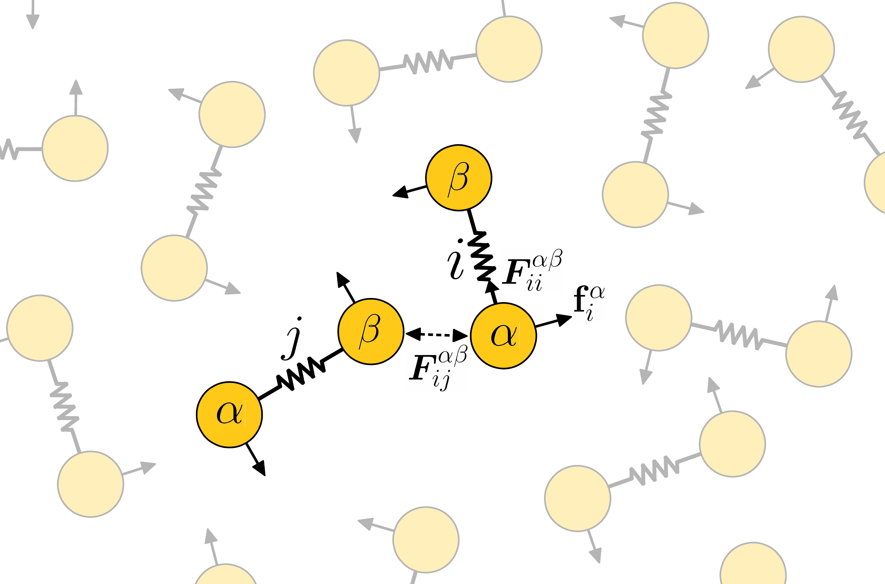

# Molecular Simulations of Active Matter

Simulation and analysis code for active matter research.

To run simulations of the chiral active dumbbell fluid described in [C. Hargus, K. Klymko, J. M. Epstein and K. K. Mandadapu arXiv:2002.10437 (2020)], you should
    
1. Download LAMMPS from https://lammps.sandia.gov/
2. Add the custom source and header files contained in this repository (in ./src) to the LAMMPS src directory (e.g. /path/to/lammps/src)
3. Compile LAMMPS following instructions at https://lammps.sandia.gov/
4. Invoke the lmp binary on a script from ./scripts. For example, `mpirun -np 24 lmp -in poiseuille.in`

